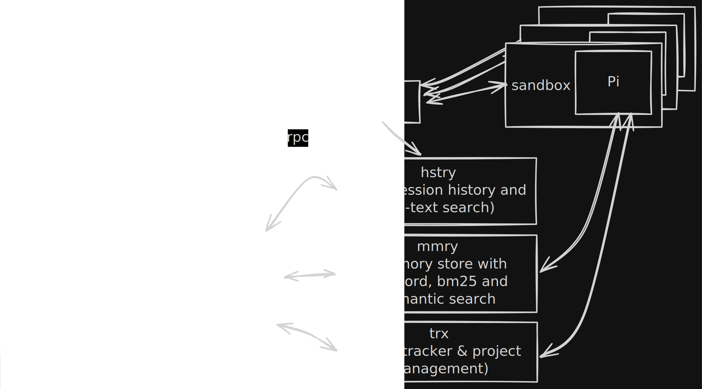

# oqto

## DISCLAIMER

oqto is still in early but very active development. Expect bugs and unfinished features. I am very much dog-fooding oqto myself and want it to work as well as possible. LLMs are still very susceptible to prompt injection. Be aware that giving an LLM-based agent unrestricted access to your personal information in combination with broad system permissions and unfiltered access to online sources (repos, web search, skills etc.) can lead to data-exfiltration, data-manipulation, installation of malware and other attacks. oqto tries to alleviate this by making isolating agents possible through fine-grained permission/sandboxing profiles. For example, an agent that can read and organize your emails does not really need access to many other tools and online sources. A single powerful agent can be very convenient but I believe that isolating multiple tasks-specific agents is the better approach for now. This has the positive side-effect of making context management easier as well. That being said, you can very much still decide to give your agents in oqto free permissions to do everything. It's your choice. I don't lock you into a walled garden, I aim to provide you with powerful tools and the freedom to do anything you want with them.

## What is oqto?

Oqto is a self-hosted, multi-user platform for working with AI agents aimed at technical and non-technical people. Each Agent workspace can be configured individually with regards to sandboxing, skills, extensions etc. It is built around [pi](https://github.com/badlogic/pi-mono/tree/main/packages/coding-agent) with rpc mode as the core agentic harness, which makes it very flexible and extensible. oqto comprises a web UI for chat, file browsing, terminal access, canvas, memory and task tracking. It also includes a browser running on the server that the Agent can control which can be streamed to the frontend, enabling users to take control when necessary. Many of the tools used by oqto are built as stand-alone tools which can also be useful outside of oqto.

Current development focuses on running oqto on a Linux server but it's technically possible to run all components on macOS as well. Right now, I would recommend running it on a Linux VM on macOS as well to avoid macOS-specific bugs.

## Architecture

The oqto backend is responsible for user authentication and management. The backend never spawns agents directly but starts them through `oqto-runner`, which wraps pi processes in a sandbox using [bubblewrap](https://github.com/containers/bubblewrap). oqto leverages the file-system for many configuration and isolation tasks. Each user gets an oqto workspace which is just a directory in their home dir. Each dir inside this workspaces can be thought of as a project or Agent with individual configuration options. This includes a sandbox profile, pi extensions and skills. This way, you can dial in the permissions per project. For even further isolation, oqto will support containerization but mind that this is still experimental.



The frontend uses a canonical agent protocol over a multiplexed WebSocket (`/api/ws/mux`). It is agent-runtime agnostic in principle -- the backend translates between the canonical protocol and agent-specific protocols like pi rpc mode.

---

### Agent runtimes

**pi**: A lightweight AI coding assistant CLI used as the central agent harness. Runs in RPC mode with JSON over stdin/stdout. Supports multiple providers (anthropic, openai, google), extensions, skills, and session compaction.

---

### Key binaries

| Binary         | Purpose                                                                                     |
| -------------- | ------------------------------------------------------------------------------------------- |
| `oqto`         | Main backend server                                                                         |
| `oqtoctl`      | CLI for server management                                                                   |
| `oqto-runner`  | Multi-user process daemon (Linux only)                                                      |
| `oqto-sandbox` | Sandbox wrapper using bwrap/sandbox-exec                                                    |
| `oqto-browser` | brower for agents inspired by [agent-broswer](https://github.com/vercel-labs/agent-browser) |
| `pi-bridge`    | HTTP/WebSocket bridge for Pi in containers                                                  |
| `oqto-files`   | File access server for workspaces                                                           |

---

### Runtime modes

| Mode        | Description              | Use Case                         |
| ----------- | ------------------------ | -------------------------------- |
| `local`     | Via `oqto-runner` daemon | Single-user and multi-user Linux |
| `container` | Inside Docker/Podman     | Full container isolation         |

Even in local mode, agents are spawned through oqto-runner, never directly by the backend. Container mode is still experimental, the current focus lies on making local multi-user mode as good as possible.

---

### Integrate with services

oqto integrates the following stand-alone tools that are being actively developmed alongside oqto. Source code available [here](https://github.com/orgs/byteowlz/repositories).

| Service   | Purpose                                                                                 |
| --------- | --------------------------------------------------------------------------------------- |
| `hstry`   | Chat history storage (per-user SQLite)                                                  |
| `mmry`    | Memory system (semantic search, embeddings)                                             |
| `trx`     | Issue/task tracking                                                                     |
| `skdlr`   | CLI for scheduling tasks                                                                |
| `eavs`    | LLM API proxy                                                                           |
| `ears`    | Realtime Speech-to-text server using the kyutai STT model and optonally nvidia parakeet |
| `kokorox` | Realtime Text-to-speech server using the kokoro onnx model                              |
| `sx`      | Search CLI for searxng and optionally online search services                            |
| `scrpr`   | Website fetcher with optional markdown conversion                                       |
| `agntz`   | Wrapper aournd the other tools so agents use one unified interface                      |

---

### Support multiple users

In multi-user mode each platform user maps to a Linux user (`oqto_{username}`). Per-user oqto-runner daemons manage agent processes and per-user mmry instances provide memory via HTTP API.

Auth uses JWT with invite codes. A progressive onboarding system with agent-driven UI unlock guides new users (planned).

## Quick Start

### Use automated setup (recommended)

This setup script has primarily been tested on an Ubuntu 24.04 VPS but targets multiple distros. Right now, many tools are still being built from source. I will provide pre-built binaries soon to substantially speed up the installation. The script also includes optional server hardening steps (firewall, fail2ban, ssh lockdown etc.)

```bash
./setup.sh
```

The interactive script handles user mode selection, backend mode, dependency installation, building, configuration, and optional systemd services. See [SETUP.md](./SETUP.md) for full details.

---

### Set up manually

I don't recommend manual setup due to many different moving pieces but it's of course technically possible to set everything up manually.

1. Install Rust and Bun
2. Build the backend:

   ```bash
   cargo install --path backend/crates/oqto
   ```

3. Build the frontend:

   ```bash
   cd frontend && bun install && bun run build
   ```

4. Install agent tools (pi, agntz, byt)
5. Configure `~/.config/oqto/config.toml`
6. Start services:

   ```bash
   oqto serve
   cd frontend && bun dev
   ```

Open `http://localhost:3000`. Check backend logs for dev credentials.

---

### Use container mode

IMPORTANT: I am focussing on local mode for now but will support container mode in the future as well.

```bash
docker build -t oqto-dev:latest -f container/Dockerfile .
```

Configure the backend to use containers in `~/.config/oqto/config.toml`:

```toml
[container]
runtime = "docker"
default_image = "oqto-dev:latest"
```

## Project Structure

```
backend/          Rust backend (API, sessions, auth, runner)
  crates/
    oqto/         Main server crate
    oqto-protocol/ Canonical agent protocol types
    oqto-files/   File server
    oqto-browser/ Browser automation
    oqto-scaffold/ Project scaffolding
frontend/         React/TypeScript UI (chat, files, terminal, canvas, memory)
deploy/           Systemd service configs, deployment scripts
docs/             Architecture docs, design specs
scripts/          Build and utility scripts
tools/            CLI tools and utilities
```

## Configuration

See [backend/crates/oqto/examples/config.toml](./backend/crates/oqto/examples/config.toml) for the full reference.

### Edit the config file (`~/.config/oqto/config.toml`)

```toml
[server]
port = 8080

[local]
enabled = true
single_user = false  # true for single-user, false for multi-user

[local.linux_users]
enabled = true       # multi-user Linux isolation

[runner]
# Pi session storage directory
pi_sessions_dir = "~/.local/share/pi/sessions"

[mmry]
enabled = true
local_service_url = "http://localhost:8081"

[hstry]
enabled = true

[auth]
dev_mode = true
```

### Set frontend environment (`.env.local`)

```bash
VITE_CONTROL_PLANE_URL=http://localhost:8080
```

Run `./setup.sh` to generate configuration files automatically.

## API

The primary interface is WebSocket-based via `/api/ws/mux` (multiplexed WebSocket). The frontend communicates over two channels:

- `agent` -- Canonical agent protocol (commands + events)
- `system` -- System notifications

---

## Development

| Component | Build           | Lint                                | Test           |
| --------- | --------------- | ----------------------------------- | -------------- |
| backend   | `cargo build`   | `cargo clippy && cargo fmt --check` | `cargo test`   |
| frontend  | `bun run build` | `bun run lint`                      | `bun run test` |

## CLI

```bash
# Server
oqto serve                    # Start API server
oqto config show              # Show configuration

# Control
oqtoctl status                # Check server health
oqtoctl session list          # List sessions
```

---

## Mobile App

The repo already includes a tauri-based mobile app that already works. I have only been able to test this on iOS so far but would be happy if someone could try running it on Android.
My plan is to soon offer a test version via Testflight on iOS.

## Roadmap

I have many ideas I want to try out but even with the help of AI coding agents, time is finite. Here are the things I want to prioritize:

- Properly fix all warnings especially on the rust side and remove any use of unsafe code and replace it with safe alternatives.
- UX/UI improvements especially with regards to workspace and sandbox configuration. This is currently not intuitive and requires too much internal knowledge.
- Ready-to-use iso image for easier setup. I haven't decided on the best distribution to base this one but am very much favoring arch linux. NixOS would maybe be even better suited but I haven't tried it out yet so my experience is the limiting factor here.
- Improved STT and TTS support: There are so many good new models out there that I want to try out and see if they could be integrated into my existing tools. The goal would be a good dialogue mode that can orchestrate agent tasks on the platform
- Support for remote workspaces: Apart from creating workspaces in userspace, I want to add first-class support for remote workspaces for even better isolation. This includes having clients on e.g. your laptop that can be reached via the platform for certain tasks. I am building a cross-platform launcher that shall eventually integrate with oqto for this.

## Contributions

The biggest support you can currently provide is trying out to set up and use oqto yourself and reporting any issues you encounter. I would also appreciate any feedback regarding the general architecture especially concerning the security aspects.

If you want to actively contribute to the codebase, I would appreciate you start a discussion beforehand to share what improvements you would like to make. I have strong options on certain aspects but am very open to suggestions in general.

## Documentation

- [SETUP.md](./SETUP.md) -- Installation guide
- [AGENTS.md](./AGENTS.md) -- Agent development guidelines
- [backend/crates/oqto/examples/config.toml](./backend/crates/oqto/examples/config.toml) -- Full configuration reference

## Acknowledgements

- [pi](https://buildwithpi.ai/) for the core agentic harness used in oqto
- [opencode](https://opencode.ai/) which served as the initial inspiration for the server/client based ai coding-agent approach
- [openclaw](https://openclaw.ai/) for the markdown-based approach to user onboarding
- [Jeffrey Emanuel aksk Dicklesworthstone](https://github.com/Dicklesworthstone) for inspiring many of the tools built for oqto
- And many, many more people that create inspiring stuff. You can look at my github stars to find many cool things others have built!

## License

MIT
