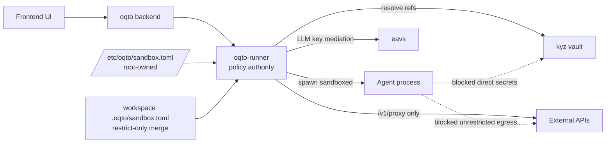

# Sandbox v2 Threat Model & Architecture (Runner-First, Remote-Ready)

Status: Draft (for oqto-cv3f)  
Owners: Oqto backend + runner  
Related epic: `oqto-6er8`  
Related issues: `oqto-cxxr`, `octo-1ddx`, `oqto-ctpz`, `oqto-05c1`, `oqto-8kx4`, `oqto-q5yb`, `oqto-3c42`, `oqto-dv37`, `oqto-g3wq`, `oqto-xf80`

---

## 1) Problem statement

Sandbox v1 relies primarily on `bwrap` policy and allows configuration paths that can be user writable in some modes. Secret handling is being expanded (kyz/eavs/proxy) and remote runners are part of the roadmap. We need a unified security model where:

- isolation is defense-in-depth (not one mechanism),
- policy authority is runner-owned and fail-closed,
- secret access is mediated and never exposed to agent process memory unless explicitly approved,
- local and remote runners follow the same trust semantics.

---

## 2) Security goals

1. **Contain agent processes** even when one isolation layer fails.
2. **Prevent policy tampering** by untrusted agent/user-space processes.
3. **Enforce deny-by-default secret access** with explicit approvals and process allowlists.
4. **Prevent direct secret exfiltration** via unrestricted network egress.
5. **Provide auditable, replayable decisions** for security operations.
6. **Fail closed** when policy/config/mediation cannot be validated.

### Non-goals

- Defending against full root compromise of the host OS.
- Replacing enterprise IAM/SSO architecture.
- Perfectly eliminating side channels (timing/cache/microarchitectural).

---

## 3) Assets and trust boundaries

## Assets

- **A1:** LLM runtime credentials (EAVS API key, provider virtual keys)
- **A2:** Tool credentials (kyz-managed secrets, API tokens, SSH material)
- **A3:** Sandbox policy and config (`/etc/oqto/sandbox.toml` and related policy files)
- **A4:** Approval records and security audit events
- **A5:** Workspace data and user home data outside explicit allowlist

## Secret classes

1. **`llm_runtime` secrets**
   - Purpose: LLM routing/runtime (eavs)
   - Scope: session/process-level runtime wiring
   - Exposure policy: injected only where required for harness execution

2. **`tool_credential` secrets**
   - Purpose: external tool/API auth (github, cloud, etc.)
   - Scope: per operation, per destination host, mediated by runner proxy
   - Exposure policy: agent receives response payload, not raw credential

## Trust boundaries

- **TB1: Frontend/Backend control plane -> Runner**
  - Commands are intent, not authority over low-level sandbox/secret policy.
- **TB2: Runner -> Agent process**
  - Agent process is untrusted execution subject.
- **TB3: Runner -> External network**
  - All secret-bearing egress must be mediated.
- **TB4: Root/system policy files -> user runtime**
  - System policy is immutable to agent/user-space writes.

---

## 4) Architecture (target)

### Control points

1. **Runner-owned spawn mediation**
   - Runner decides `sandboxed` execution policy and refuses unsafe fallbacks.
2. **Layered sandbox enforcement**
   - `no_new_privs`, capability drop, seccomp allowlist, Landlock (when available), cgroup limits.
3. **Deterministic policy merge**
   - Global root-owned policy + workspace restrict-only overlay.
4. **Credential mediation**
   - Agent sends secret reference; runner resolves secret and performs outbound request.
5. **Network policy coupling**
   - Secret-bearing flows require proxy-only egress mode with host allowlist pinning.

---

## 5) Threat model (STRIDE-style)

## S: Spoofing

- **T-S1:** Malicious process impersonates runner or bypasses approved process identity.
- **Mitigations:** runner auth (separate epic), per-process allowlist identity checks, immutable runner-side policy source.

## T: Tampering

- **T-T1:** Agent modifies sandbox config or workspace policy to weaken restrictions.
- **Mitigations:** root-owned global config (`/etc/oqto/sandbox.toml`), deny-write self-protection, restrict-only merge semantics.

- **T-T2:** Agent mutates injected env/config to retain long-lived secret access.
- **Mitigations:** short-lived tokenization where possible, per-spawn injection decisions, runner-side redaction and scrubbed logs.

## R: Repudiation

- **T-R1:** No durable trail for approvals/denials/proxy decisions.
- **Mitigations:** structured audit events for policy decision points and security-relevant actions.

## I: Information disclosure

- **T-I1:** Tool credentials leak into agent stdout/stderr/history.
- **Mitigations:** never return plaintext credentials, response redaction policy, explicit non-echo contract in proxy.

- **T-I2:** Agent reads files outside policy via filesystem escapes.
- **Mitigations:** bwrap + Landlock + deny lists + workspace boundary enforcement + escape regression tests.

## D: Denial of service

- **T-D1:** Agent forks/resource-exhausts host.
- **Mitigations:** cgroup resource quotas + kill semantics, pid namespace isolation, timeout enforcement.

## E: Elevation of privilege

- **T-E1:** Exploit in one layer yields host privilege escalation.
- **Mitigations:** no_new_privs, capability drop, seccomp deny, layered fallback chain with fail-closed behavior.

---

## 6) Deny-by-default policy semantics

All access not explicitly allowed is denied.

### 6.1 Sandbox policy

- Start from strict baseline.
- Workspace policy may only **add restrictions**, never relax global restrictions.
- If policy parse/validation fails -> deny sandboxed spawn (fail closed).

### 6.2 Secret policy

For each secret operation, require explicit match on:

- `secret_class` (`llm_runtime` or `tool_credential`)
- `secret_ref` pattern/ID
- `target_host` allowlist
- `request_shape` constraints (method/path/header policy)
- `process_identity` allowlist (approved binaries/tools)
- `approval_mode` (auto/explicit/session)

If any attribute is missing or unmatched -> deny.

### 6.3 Network policy coupling

When operation involves `tool_credential`:

- direct agent egress is denied,
- agent must call runner proxy,
- proxy enforces host pinning + audit logging.

---

## 7) Bypass resistance strategy

1. **No trust in agent honesty**: never rely on agent-side wrappers for enforcement.
2. **Runner mediation is mandatory** for secret-bearing operations.
3. **Sandbox + proxy coupling**: if proxy-only mode required but unavailable, request fails.
4. **Fail closed defaults**:
   - missing/invalid config -> no sandboxed spawn
   - secret policy unavailable -> deny secret operation
   - unknown process identity -> require approval or deny
5. **Defense in depth**: bwrap/Landlock/seccomp/cap-drop/cgroups are additive, not alternative trust anchors.

---

## 8) Local vs remote runner data flow

## Local runner

- Backend dispatches spawn/operation intent.
- Runner loads trusted system policy, merges workspace restrictions.
- Agent runs sandboxed.
- Secret-bearing calls go through local runner proxy.

## Remote runner

- Same decision model as local runner.
- Control-plane authentication required (tracked separately).
- Secret resolution remains runner-local to user vault context.
- Policy and audit events remain attributable to the remote runner identity.

Security invariant: **remote does not weaken policy semantics**; only transport changes.

---

## 9) Required telemetry and audits

Emit structured events for:

- sandbox profile selected, enforcement layers active (bwrap/seccomp/landlock/caps/cgroup)
- policy merge result hash/version
- secret operation allow/deny with reason code
- approval requests/outcomes (who, what, scope, TTL)
- host allowlist violations
- fail-closed rejections

Minimum fields: timestamp, session_id, runner_id, workspace_id, process_id, decision, reason_code.

---

## 10) Test requirements (feeds oqto-dv37)

1. **Sandbox escape regression suite**
   - path traversal, symlink tricks, namespace escape attempts, forbidden syscall probes.
2. **Secret injection matrix**
   - approved vs unapproved process, allowed vs disallowed host, valid vs invalid secret ref.
3. **Fail-closed tests**
   - missing config, malformed config, proxy unavailable, policy store unavailable.
4. **Remote parity tests**
   - local and remote runner produce identical allow/deny outcomes for same policy vectors.

---

## 11) Proposed implementation ordering

1. `oqto-cv3f` (this doc, schema decisions, invariants)
2. `octo-1ddx` (root-owned global config path enforcement)
3. `oqto-cxxr` (sandbox hardening layers)
4. `oqto-ctpz` + `oqto-8kx4` + `oqto-q5yb` + `oqto-05c1`
5. `oqto-3c42` (policy coupling: secrets <-> sandbox/network)
6. `oqto-dv37` + `oqto-g3wq` + `oqto-xf80`

---

## 12) Open questions

1. Should `llm_runtime` secrets always bypass approval, or support optional approval domains?
2. Do we require per-destination TLS pinning for high-risk credential classes?
3. What is the canonical process identity primitive (binary hash, path, signer, or combination)?
4. Should session-scoped approvals be default-deny in strict profile?

---

## 13) Definition of done for oqto-cv3f

- Threat model and architecture doc approved by backend/runner maintainers.
- Secret classes and deny-by-default semantics agreed.
- Bypass resistance and fail-closed invariants explicitly accepted.
- Open questions converted to follow-up issues or resolved in-scope.
