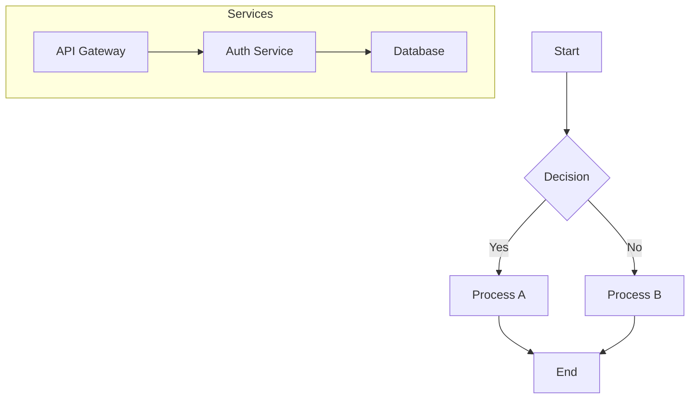

# Mermaid Canvas Library - Product Requirements Document

## Executive Summary

Build a standalone TypeScript/React library that provides a **bidirectional visual editor for Mermaid diagrams**. The key innovation is separating **semantic content** (Mermaid syntax) from **visual layout** (positions, styles), enabling:

1. **Agents** to read/write standard Mermaid files
2. **Users** to visually edit diagrams with drag-and-drop
3. **Bidirectional sync** without data loss

This library will be imported into our main workspace project to provide a collaborative canvas alongside the chat interface.

---

## Problem Statement

Current tools fail at bidirectional Mermaid editing:

| Tool | Mermaid -> Visual | Visual -> Mermaid | Issue |
|------|-------------------|-------------------|-------|
| Excalidraw | Yes | Partial (flowcharts only) | Freehand drawings don't convert back |
| Mermaid Chart | Yes | Yes (flowcharts only) | Commercial, limited diagram types |
| D2 Studio | Yes | Yes | MPL-2.0 license (copyleft), different syntax |
| React Flow editors | Yes | No | No reverse conversion exists |

**Our Solution:** Store diagram data in two files:
- `*.mmd` - Pure Mermaid syntax (agent-readable/writable)
- `*.layout.json` - Visual metadata (positions, styles, viewport)

---

## Architecture

### File Structure

```
diagrams/
  architecture.mmd           # Mermaid source (semantic content)
  architecture.layout.json   # Visual metadata (positions, styles)
  user-flow.mmd
  user-flow.layout.json
```

### Data Model

#### Mermaid File (`architecture.mmd`)


#### Layout File (`architecture.layout.json`)
```json
{
  "version": 1,
  "diagramType": "flowchart",
  "nodes": {
    "A": {
      "position": { "x": 100, "y": 50 },
      "dimensions": { "width": 120, "height": 60 },
      "style": { "backgroundColor": "#e3f2fd" }
    },
    "B": {
      "position": { "x": 100, "y": 150 },
      "dimensions": { "width": 140, "height": 80 }
    },
    "C": {
      "position": { "x": 250, "y": 280 }
    },
    "D": {
      "position": { "x": -50, "y": 280 }
    },
    "E": {
      "position": { "x": 100, "y": 400 }
    },
    "Services": {
      "position": { "x": 400, "y": 100 },
      "dimensions": { "width": 300, "height": 250 },
      "style": { "backgroundColor": "#f5f5f5", "borderColor": "#9e9e9e" }
    },
    "F": { "position": { "x": 420, "y": 130 } },
    "G": { "position": { "x": 420, "y": 210 } },
    "H": { "position": { "x": 420, "y": 290 } }
  },
  "edges": {
    "A->B": {
      "style": { "strokeColor": "#1976d2", "strokeWidth": 2 }
    },
    "B->C[Yes]": {
      "labelPosition": { "x": 10, "y": -5 }
    }
  },
  "viewport": {
    "x": 0,
    "y": 0,
    "zoom": 1
  },
  "metadata": {
    "lastModified": "2024-12-24T10:30:00Z",
    "createdBy": "user",
    "autoLayoutApplied": false
  }
}
```

### Component Architecture

```
+------------------------------------------------------------------+
|                     MermaidCanvas (Main Component)                |
+------------------------------------------------------------------+
|  +------------------+  +---------------------+  +---------------+ |
|  | MermaidEditor    |  | ReactFlowCanvas     |  | Toolbar       | |
|  | (Monaco/CodeMir) |  | (Visual Editor)     |  | (Actions)     | |
|  +------------------+  +---------------------+  +---------------+ |
|           |                      |                     |          |
|           v                      v                     v          |
|  +------------------------------------------------------------------+
|  |                    CanvasStore (Zustand)                        |
|  |  - mermaidSource: string                                        |
|  |  - layoutData: LayoutData                                       |
|  |  - nodes: Node[]                                                |
|  |  - edges: Edge[]                                                |
|  |  - isDirty: boolean                                             |
|  +------------------------------------------------------------------+
|           |                      |                     |          |
|           v                      v                     v          |
|  +------------------+  +---------------------+  +---------------+ |
|  | MermaidParser    |  | LayoutMerger        |  | AutoLayout    | |
|  | (AST extraction) |  | (Position sync)     |  | (Dagre)       | |
|  +------------------+  +---------------------+  +---------------+ |
+------------------------------------------------------------------+
                              |
                              v
               +------------------------------+
               |      FileAdapter Interface   |
               +------------------------------+
               |  - loadDiagram(path)         |
               |  - saveDiagram(path, data)   |
               |  - watchChanges(path, cb)    |
               +------------------------------+
                    /                  \
                   /                    \
    +------------------+      +------------------------+
    | LocalFileAdapter |      | FileServerAdapter      |
    | (Node.js fs)     |      | (HTTP API)             |
    +------------------+      +------------------------+
```

---

## Core Features

### 1. Mermaid Parsing & Conversion

**Input:** Mermaid source string
**Output:** Semantic model (nodes, edges, subgraphs)

```typescript
interface DiagramModel {
  type: 'flowchart' | 'sequence' | 'classDiagram' | 'stateDiagram' | 'erDiagram';
  direction?: 'TD' | 'TB' | 'BT' | 'LR' | 'RL';
  nodes: Map<string, NodeModel>;
  edges: Map<string, EdgeModel>;
  subgraphs: Map<string, SubgraphModel>;
}

interface NodeModel {
  id: string;
  label: string;
  shape: 'rectangle' | 'rounded' | 'diamond' | 'circle' | 'stadium' | 'subroutine' | 'cylinder' | 'parallelogram' | 'trapezoid' | 'hexagon';
  parentSubgraph?: string;
}

interface EdgeModel {
  id: string;  // Generated: "sourceId->targetId" or "sourceId->targetId[label]"
  source: string;
  target: string;
  label?: string;
  type: 'arrow' | 'open' | 'dotted' | 'thick';
  arrowhead: 'normal' | 'circle' | 'cross' | 'none';
}

interface SubgraphModel {
  id: string;
  label: string;
  nodeIds: string[];
  parentSubgraph?: string;
}
```

**Implementation Notes:**
- Use `mermaid` library to render SVG first (extracts positions)
- Use Mermaid's internal APIs: `mermaid.mermaidAPI.getDiagramFromText()`, then `diagram.db.getVertices()`, `diagram.db.getEdges()`
- Reference implementation: `@excalidraw/mermaid-to-excalidraw` parser
- Fallback: Parse Mermaid syntax directly using regex for simple flowcharts

### 2. Layout Merge & Sync

**Merge Algorithm (on load):**
```typescript
function mergeModelWithLayout(
  model: DiagramModel,
  layout: LayoutData
): ReactFlowState {
  const nodes: Node[] = [];
  
  for (const [id, nodeModel] of model.nodes) {
    const layoutNode = layout.nodes[id];
    
    if (layoutNode) {
      // Use stored position
      nodes.push({
        id,
        type: mapShapeToNodeType(nodeModel.shape),
        position: layoutNode.position,
        data: { label: nodeModel.label, ...nodeModel },
        style: layoutNode.style,
        ...(layoutNode.dimensions && {
          width: layoutNode.dimensions.width,
          height: layoutNode.dimensions.height
        })
      });
    } else {
      // New node - needs auto-layout
      nodes.push({
        id,
        type: mapShapeToNodeType(nodeModel.shape),
        position: { x: 0, y: 0 }, // Will be positioned by Dagre
        data: { label: nodeModel.label, ...nodeModel, needsLayout: true }
      });
    }
  }
  
  // Auto-layout nodes marked with needsLayout
  return applyAutoLayoutToNewNodes(nodes, edges);
}
```

**Diff Detection (for agent edits):**
```typescript
interface ModelDiff {
  addedNodes: string[];
  removedNodes: string[];
  renamedNodes: Map<string, string>;  // oldId -> newId
  modifiedNodes: string[];  // Label or shape changed
  addedEdges: string[];
  removedEdges: string[];
  modifiedEdges: string[];
}

function diffModels(oldModel: DiagramModel, newModel: DiagramModel): ModelDiff;
```

### 3. React Flow Canvas

**Custom Node Types:**
- `default` - Rectangle
- `rounded` - Rounded rectangle (stadium)
- `diamond` - Decision node
- `circle` - Circle
- `subgraph` - Container for grouped nodes

**Features:**
- Pan and zoom (built-in)
- Node selection (single and multi)
- Node dragging with snap-to-grid (optional)
- Edge reconnection
- Node resizing
- Subgraph/group support
- Minimap
- Controls (zoom in/out, fit view)

### 4. Mermaid Generation (Reverse Conversion)

**From React Flow state back to Mermaid:**

```typescript
function generateMermaid(
  model: DiagramModel,
  options?: GenerateOptions
): string {
  const lines: string[] = [];
  
  // Header
  lines.push(`flowchart ${model.direction || 'TD'}`);
  
  // Subgraphs first (with their nodes)
  for (const [id, subgraph] of model.subgraphs) {
    lines.push(`    subgraph ${id}[${subgraph.label}]`);
    // Nodes inside subgraph are implicit
    lines.push(`    end`);
  }
  
  // Standalone nodes with shapes
  for (const [id, node] of model.nodes) {
    if (!node.parentSubgraph) {
      lines.push(`    ${formatNode(id, node)}`);
    }
  }
  
  // Edges
  for (const [, edge] of model.edges) {
    lines.push(`    ${formatEdge(edge)}`);
  }
  
  return lines.join('\n');
}

function formatNode(id: string, node: NodeModel): string {
  const shapes: Record<string, [string, string]> = {
    rectangle: ['[', ']'],
    rounded: ['(', ')'],
    stadium: ['([', '])'],
    diamond: ['{', '}'],
    circle: ['((', '))'],
    // ... etc
  };
  const [open, close] = shapes[node.shape] || ['[', ']'];
  return `${id}${open}${node.label}${close}`;
}
```

### 5. File Adapters

#### LocalFileAdapter (for CLI/desktop use)
```typescript
class LocalFileAdapter implements FileAdapter {
  constructor(private basePath: string) {}
  
  async loadDiagram(name: string): Promise<DiagramFiles> {
    const mmdPath = path.join(this.basePath, `${name}.mmd`);
    const layoutPath = path.join(this.basePath, `${name}.layout.json`);
    
    const mermaidSource = await fs.readFile(mmdPath, 'utf-8');
    const layoutData = await fs.readFile(layoutPath, 'utf-8')
      .then(JSON.parse)
      .catch(() => null);  // Layout file may not exist yet
    
    return { mermaidSource, layoutData };
  }
  
  async saveDiagram(name: string, data: DiagramFiles): Promise<void> {
    const mmdPath = path.join(this.basePath, `${name}.mmd`);
    const layoutPath = path.join(this.basePath, `${name}.layout.json`);
    
    await fs.writeFile(mmdPath, data.mermaidSource, 'utf-8');
    await fs.writeFile(layoutPath, JSON.stringify(data.layoutData, null, 2), 'utf-8');
  }
  
  watchChanges(name: string, callback: (files: DiagramFiles) => void): () => void {
    // Use chokidar or fs.watch
    const watcher = chokidar.watch([
      path.join(this.basePath, `${name}.mmd`),
      path.join(this.basePath, `${name}.layout.json`)
    ]);
    
    watcher.on('change', async () => {
      const files = await this.loadDiagram(name);
      callback(files);
    });
    
    return () => watcher.close();
  }
}
```

#### FileServerAdapter (for web/container use)

This adapter uses the existing fileserver API (see `/workspace/fileserver/`).

```typescript
class FileServerAdapter implements FileAdapter {
  constructor(
    private baseUrl: string,  // e.g., "http://localhost:41821"
    private diagramsPath: string = "diagrams"
  ) {}
  
  async loadDiagram(name: string): Promise<DiagramFiles> {
    const mmdPath = `${this.diagramsPath}/${name}.mmd`;
    const layoutPath = `${this.diagramsPath}/${name}.layout.json`;
    
    const mermaidSource = await fetch(`${this.baseUrl}/file?path=${encodeURIComponent(mmdPath)}`)
      .then(r => r.text());
    
    const layoutData = await fetch(`${this.baseUrl}/file?path=${encodeURIComponent(layoutPath)}`)
      .then(r => r.json())
      .catch(() => null);
    
    return { mermaidSource, layoutData };
  }
  
  async saveDiagram(name: string, data: DiagramFiles): Promise<void> {
    const mmdPath = `${this.diagramsPath}/${name}.mmd`;
    const layoutPath = `${this.diagramsPath}/${name}.layout.json`;
    
    // Upload Mermaid file
    const mmdFormData = new FormData();
    mmdFormData.append('file', new Blob([data.mermaidSource], { type: 'text/plain' }), `${name}.mmd`);
    await fetch(`${this.baseUrl}/file?path=${encodeURIComponent(mmdPath)}&mkdir=true`, {
      method: 'POST',
      body: mmdFormData
    });
    
    // Upload layout file
    const layoutFormData = new FormData();
    layoutFormData.append('file', new Blob([JSON.stringify(data.layoutData, null, 2)], { type: 'application/json' }), `${name}.layout.json`);
    await fetch(`${this.baseUrl}/file?path=${encodeURIComponent(layoutPath)}&mkdir=true`, {
      method: 'POST',
      body: layoutFormData
    });
  }
  
  watchChanges(name: string, callback: (files: DiagramFiles) => void): () => void {
    // Poll-based watching (fileserver doesn't support WebSocket yet)
    // TODO: Add WebSocket support to fileserver for real-time sync
    const interval = setInterval(async () => {
      const files = await this.loadDiagram(name);
      callback(files);
    }, 2000);  // Poll every 2 seconds
    
    return () => clearInterval(interval);
  }
}
```

---

## API Design

### React Component API

```tsx
import { MermaidCanvas, LocalFileAdapter, FileServerAdapter } from '@workspace/mermaid-canvas';

// Option 1: Local development
const adapter = new LocalFileAdapter('./diagrams');

// Option 2: Container/web deployment  
const adapter = new FileServerAdapter('http://localhost:41821', 'diagrams');

function App() {
  return (
    <MermaidCanvas
      adapter={adapter}
      diagramName="architecture"
      
      // Optional props
      readOnly={false}
      showMinimap={true}
      showControls={true}
      showCodeEditor={true}  // Side-by-side Mermaid editor
      
      // Callbacks
      onSave={(files) => console.log('Saved:', files)}
      onChange={(model) => console.log('Changed:', model)}
      onError={(error) => console.error('Error:', error)}
      
      // Customization
      nodeTypes={customNodeTypes}
      edgeTypes={customEdgeTypes}
      theme="light"  // or "dark"
    />
  );
}
```

### Programmatic API (for agent integration)

```typescript
import { 
  parseMermaid, 
  generateMermaid, 
  mergeWithLayout,
  diffModels,
  applyAutoLayout
} from '@workspace/mermaid-canvas';

// Parse Mermaid to model
const model = await parseMermaid(`
  flowchart TD
    A[Start] --> B[End]
`);

// Generate Mermaid from model
const mermaidSource = generateMermaid(model);

// Merge with layout for rendering
const { nodes, edges } = mergeWithLayout(model, layoutData);

// Detect changes between versions
const diff = diffModels(oldModel, newModel);

// Apply auto-layout to nodes without positions
const layoutedNodes = applyAutoLayout(nodes, edges, { direction: 'TB' });
```

### Store API (for advanced control)

```typescript
import { useCanvasStore } from '@workspace/mermaid-canvas';

function MyComponent() {
  const {
    // State
    mermaidSource,
    layoutData,
    nodes,
    edges,
    selectedNodes,
    isDirty,
    
    // Actions
    loadDiagram,
    saveDiagram,
    updateMermaid,
    updateLayout,
    setSelectedNodes,
    applyAutoLayout,
    undo,
    redo,
    
    // Agent-specific actions
    applyAgentEdit,  // Handles diff and preserves layout
  } = useCanvasStore();
  
  // Example: Agent updates the Mermaid
  const handleAgentEdit = async (newMermaid: string) => {
    await applyAgentEdit(newMermaid);  // Preserves user's layout
  };
}
```

---

## Sync Behavior

### Scenario 1: User Edits Canvas

1. User drags node A to new position
2. `onNodesChange` fires in React Flow
3. Store updates `nodes` state
4. Store updates `layoutData.nodes.A.position`
5. Debounced save triggers `adapter.saveDiagram()`
6. Only `*.layout.json` changes (Mermaid unchanged)

### Scenario 2: User Edits Mermaid Code

1. User types in code editor: adds new node `Z[New Node]`
2. `onMermaidChange` debounces and parses new source
3. `diffModels()` detects added node `Z`
4. Node `Z` gets auto-layout position via Dagre
5. Store updates both `mermaidSource` and `layoutData`
6. `adapter.saveDiagram()` writes both files

### Scenario 3: Agent Edits Mermaid File

1. Agent writes to `architecture.mmd` via fileserver
2. File watcher detects change, loads new content
3. `parseMermaid()` creates new model
4. `diffModels(oldModel, newModel)` detects changes:
   - Added nodes: Get auto-layout positions
   - Removed nodes: Remove from layout
   - Renamed nodes: Attempt to preserve layout by matching labels
   - Modified nodes: Preserve position, update other properties
5. Store merges changes, preserving user's layout where possible
6. Canvas re-renders with new state
7. Layout file automatically updated with new positions

### Scenario 4: Conflict Resolution

If both user and agent edit simultaneously:
1. User's visual changes are in memory (not yet saved)
2. Agent's Mermaid file change detected
3. System compares:
   - If user only changed positions: Merge cleanly
   - If user added/removed nodes: Mark conflict
4. On conflict: Show diff dialog, let user choose

---

## Technology Stack

### Core Dependencies

```json
{
  "dependencies": {
    "@xyflow/react": "^12.0.0",
    "mermaid": "^11.0.0",
    "dagre": "^0.8.5",
    "zustand": "^4.5.0",
    "immer": "^10.0.0"
  },
  "devDependencies": {
    "typescript": "^5.3.0",
    "vite": "^5.0.0",
    "vitest": "^1.0.0",
    "@types/dagre": "^0.7.0"
  },
  "peerDependencies": {
    "react": "^18.0.0 || ^19.0.0",
    "react-dom": "^18.0.0 || ^19.0.0"
  }
}
```

### License Compliance

All dependencies are MIT licensed:
- `@xyflow/react` (React Flow): MIT
- `mermaid`: MIT
- `dagre`: MIT
- `zustand`: MIT
- `immer`: MIT

---

## Project Structure

```
mermaid-canvas/
  src/
    index.ts                    # Public API exports
    
    components/
      MermaidCanvas.tsx         # Main component
      ReactFlowCanvas.tsx       # React Flow wrapper
      MermaidEditor.tsx         # Code editor (optional)
      Toolbar.tsx               # Action buttons
      Minimap.tsx               # Minimap wrapper
      nodes/
        DefaultNode.tsx
        RoundedNode.tsx
        DiamondNode.tsx
        SubgraphNode.tsx
        index.ts
      edges/
        DefaultEdge.tsx
        DottedEdge.tsx
        index.ts
    
    store/
      canvasStore.ts            # Zustand store
      types.ts                  # Store types
    
    parser/
      mermaidParser.ts          # Mermaid -> DiagramModel
      mermaidGenerator.ts       # DiagramModel -> Mermaid
      flowchartParser.ts        # Flowchart-specific parsing
      types.ts                  # Parser types
    
    layout/
      autoLayout.ts             # Dagre integration
      layoutMerger.ts           # Merge layout with model
      diffEngine.ts             # Model diffing
    
    adapters/
      types.ts                  # FileAdapter interface
      localAdapter.ts           # Node.js filesystem
      fileServerAdapter.ts      # HTTP fileserver
      memoryAdapter.ts          # In-memory (for testing)
    
    utils/
      edgeId.ts                 # Edge ID generation
      nodeShapes.ts             # Shape mapping
      debounce.ts
    
    hooks/
      useCanvasStore.ts         # Store hook
      useDiagram.ts             # High-level diagram hook
      useAutoSave.ts            # Auto-save logic
      useFileWatch.ts           # File watching
    
    themes/
      light.ts
      dark.ts
  
  examples/
    basic/                      # Minimal example
    with-fileserver/            # Fileserver integration
    standalone-app/             # Full standalone app
  
  tests/
    parser/
      mermaidParser.test.ts
      mermaidGenerator.test.ts
    layout/
      diffEngine.test.ts
      layoutMerger.test.ts
    integration/
      roundtrip.test.ts         # Mermaid -> Canvas -> Mermaid
  
  package.json
  tsconfig.json
  vite.config.ts
  vitest.config.ts
  README.md
```

---

## Implementation Phases

### Phase 1: Core Parser (3-4 days)
- [ ] Mermaid flowchart parsing via Mermaid API
- [ ] DiagramModel type definitions
- [ ] Basic Mermaid generation (flowcharts)
- [ ] Unit tests for parser/generator

### Phase 2: React Flow Integration (3-4 days)
- [ ] Basic ReactFlowCanvas component
- [ ] Custom node types for Mermaid shapes
- [ ] Layout merger (model + layout -> React Flow state)
- [ ] Dagre auto-layout integration

### Phase 3: Store & State Management (2-3 days)
- [ ] Zustand store implementation
- [ ] Undo/redo support
- [ ] Dirty state tracking
- [ ] Change callbacks

### Phase 4: File Adapters (2-3 days)
- [ ] FileAdapter interface
- [ ] LocalFileAdapter (Node.js)
- [ ] FileServerAdapter (HTTP)
- [ ] File watching / polling

### Phase 5: Bidirectional Sync (3-4 days)
- [ ] Model diffing algorithm
- [ ] Layout preservation on Mermaid changes
- [ ] Conflict detection
- [ ] Agent edit flow

### Phase 6: Polish & Examples (2-3 days)
- [ ] MermaidCanvas component wrapper
- [ ] Code editor integration (optional)
- [ ] Toolbar component
- [ ] Example applications
- [ ] Documentation

**Total Estimate: ~15-20 days**

---

## Testing Strategy

### Unit Tests
- Parser: Mermaid syntax -> DiagramModel (various diagram types)
- Generator: DiagramModel -> Mermaid syntax
- Diff engine: Detect added/removed/renamed/modified nodes
- Layout merger: Preserve positions, auto-layout new nodes

### Integration Tests
- Roundtrip: Mermaid -> Canvas -> Mermaid (content preserved)
- File sync: Load -> Edit -> Save -> Reload (state consistent)
- Agent edit: External file change -> Canvas updates correctly

### E2E Tests (optional)
- User drags node -> Layout file updates
- User adds node via editor -> Canvas updates
- Simulated agent edit -> Canvas reflects changes

---

## Success Criteria

1. **Bidirectional Sync Works:** Edit Mermaid file externally, canvas updates; edit canvas, Mermaid regenerates
2. **Layout Preserved:** User's node positions survive agent edits that don't change structure
3. **No Data Loss:** Round-trip (Mermaid -> Canvas -> Mermaid) preserves all semantic content
4. **Clean Separation:** Mermaid files remain human-readable, layout files are optional
5. **Agent-Friendly:** Standard Mermaid syntax that any LLM can generate

---

## Open Questions

1. **Subgraph Editing:** Allow users to create subgraphs visually? Or Mermaid-only?
2. **Sequence Diagrams:** Worth supporting? Different rendering paradigm
3. **Real-time Collaboration:** Add Yjs/CRDT support for multi-user editing?
4. **WebSocket Fileserver:** Add WebSocket support for instant sync vs polling?

---

## References

### Existing Projects (for inspiration)
- `albingcj/mermaid-reactflow-editor` - Mermaid -> React Flow (one-way)
- `@excalidraw/mermaid-to-excalidraw` - Mermaid parsing approach
- `@excalidraw-to-mermaid/core` - Reverse conversion approach

### Documentation
- [React Flow Docs](https://reactflow.dev/docs)
- [Mermaid Syntax](https://mermaid.js.org/syntax/flowchart.html)
- [Dagre Layout](https://github.com/dagrejs/dagre/wiki)
- [Zustand](https://zustand-demo.pmnd.rs/)

### Workspace Integration
- Fileserver API: `/workspace/fileserver/README.md`
- Fileserver handlers: `/workspace/fileserver/src/handlers.rs`
